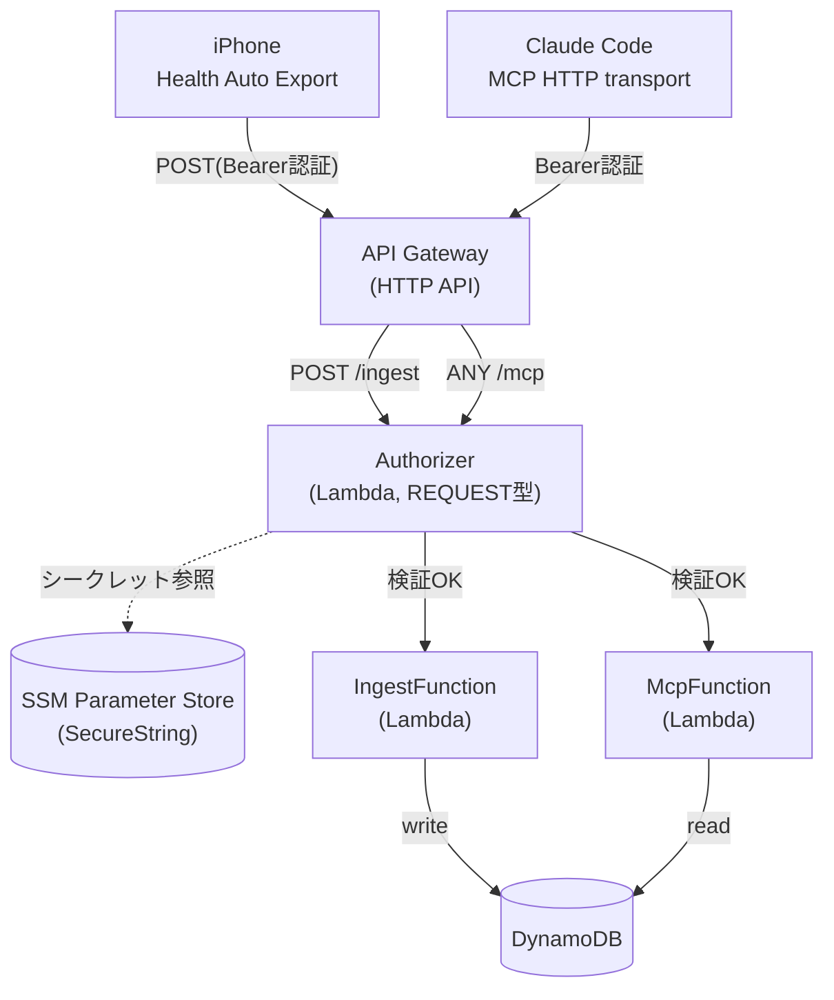

# Apple WatchヘルスデータMCPパイプライン 基本設計

対象要件は「要件定義.md」を参照。本書ではAWSサーバーレス構成の具体設計を記載する。

## 1. システム構成概要


- 取り込み(ingest)と問い合わせ(MCP)を別Lambda関数に分離し、IAM権限を最小化する(IngestFunctionは書き込みのみ、McpFunctionは読み取りのみ)。
- Authorizer (Lambda, REQUEST型) が両ルートの認証を担当する。
- シークレットは SSM Parameter Store (SecureString) に保管する。
- 両ルートともアイドル時は課金が発生しない(呼び出し時のみLambdaが起動)。

## 2. コンポーネント一覧

| コンポーネント | 役割 |
|---|---|
| API Gateway(HTTP API) | `/ingest`と`/mcp`の2ルートを公開する入口。REST APIではなくHTTP API(安価・シンプル)を採用 |
| Lambda Authorizer | リクエストヘッダーの`Authorization: Bearer <secret>`をSSM上のシークレットと比較し可否判定。両ルート共通で使用 |
| IngestFunction(Lambda) | Health Auto ExportからのJSONペイロードを受信・パースし、単位正規化した上でDynamoDBへ書き込み |
| McpFunction(Lambda) | FastMCP + Mangumで実装。MCPのStreamable HTTPプロトコルに従い、Claude Codeからのツール呼び出しに応答 |
| DynamoDB | 正規化済みヘルスデータの保存先。シングルテーブル設計 |
| SSM Parameter Store | 認証用シークレットの保管(SecureString) |

## 3. 認証設計

- HTTP API(v2)はREST API(v1)のような「APIキー+使用量プラン」機能を持たないため、**Lambda Authorizer(REQUEST型)** で共通シークレットを検証する方式を採用する。
- シークレットはSSM Parameter Store(`/health-mcp/shared-secret`, SecureString)に保管し、コードや設定ファイルに平文で残さない。
- iPhone側: Health Auto ExportのAutomations設定でカスタムヘッダー`Authorization: Bearer <secret>`を追加する。
- Claude Code側: `claude mcp add --transport http health-data <API GatewayのURL>/mcp --header "Authorization: Bearer <secret>"` で登録する。

## 4. データモデル(DynamoDB)

シングルテーブル設計とする。個人利用規模のため、GSIは初期スコープでは作成しない(必要になった時点で追加検討)。

| 属性 | 例 | 備考 |
|---|---|---|
| pk (パーティションキー) | `METRIC#active_energy` / `WORKOUT#2026-07-19` | 指標種別ごとにパーティションを分ける |
| sk (ソートキー) | `2026-07-19T08:00:00` | ISO8601形式のタイムスタンプ。期間指定クエリは`BETWEEN`で実現 |
| value | `172.3` (Decimal) | 正規化後の数値 |
| unit | `kcal` | 正規化後の単位 |
| source | `Apple Watch` | データ取得元(HAEペイロードのsourceをそのまま格納) |

## 5. 単位正規化仕様

IngestFunctionでの書き込み前処理として、以下のルールを適用する。

| 入力単位 | 変換 | 出力単位 |
|---|---|---|
| kJ | `value / 4.184` | kcal |
| kcal | 変換なし | kcal |
| (今後判明した単位不整合があれば都度追加) | | |

過去のkcal/kJ混同不具合の再発防止のため、**保存後の値には常にunit属性を付与**し、単位を暗黙の前提にしない。

## 6. MCPツール仕様(初期スコープ)

FastMCPで以下のツールを実装する。ツールは今後拡張可能な設計とする(要件N-5)。

| ツール名 | 引数 | 返り値概要 |
|---|---|---|
| `get_metric_summary` | metric_name, start_date, end_date | 指定期間の平均・合計・最大・最小・単位 |
| `get_workouts` | start_date, end_date | ワークアウト一覧(種別・時間・消費エネルギー) |
| `get_sleep_summary` | start_date, end_date | 睡眠時間・内訳のサマリー |
| `get_trend` | metric_name, days | 直近N日間のトレンド(傾き等) |

## 7. ルーティング仕様

```
POST /ingest   → IngestFunction  (Authorizer必須)
ANY  /mcp      → McpFunction     (Authorizer必須、GET/POST/DELETEを許可)
```

`/mcp`はStreamable HTTP仕様上、SSEストリーム用のGET・メッセージ送信用のPOST・セッション終了用のDELETEを扱うため`ANY`で設定する。

## 8. 実装方針・技術スタック

- 言語: Python
- MCPサーバー実装: `fastmcp` + `mangum`(ASGI→Lambda変換アダプタ)
- DynamoDBアクセス: `boto3`
- IaC: AWS SAMまたはCDKでリソース定義(Lambda×3、DynamoDBテーブル、HTTP API、IAMロールをコード管理する)
- ロギング: CloudWatch Logsへ出力(標準のLambdaログ設定で可)

## 9. コスト想定

個人利用(1時間毎の自動同期+随時の分析クエリ)であれば、Lambda・DynamoDB・API Gateway(HTTP API)のいずれも無料利用枠内に収まる想定。Aurora Serverlessのような最低課金が発生するリソースは採用しない。

## 10. 未決事項・今後の検討課題

- IaCツールの最終選定(SAM vs CDK)
- CloudWatch Alarmなど監視・エラー通知の要否
- DynamoDBのバックアップ/リストア方針
- MCPツールの追加(比較分析、複数指標の相関など)
- Health Auto Export側の実際のJSONペイロード構造に合わせたパース処理の精緻化
