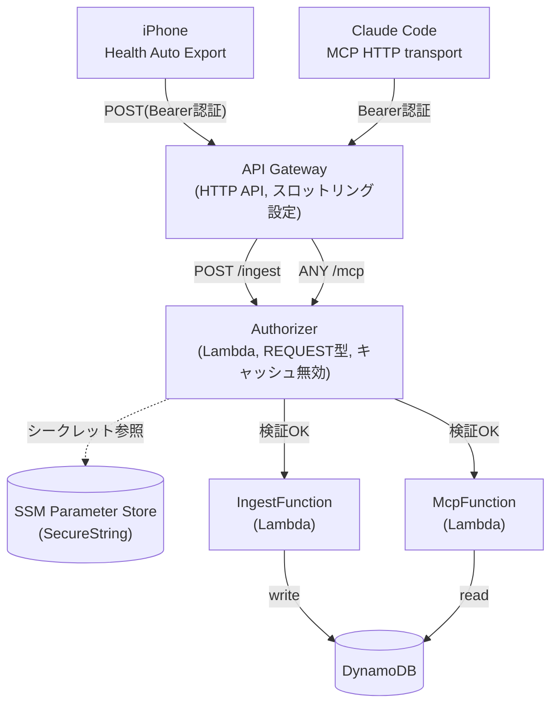

# Apple WatchヘルスデータMCPパイプライン 基本設計

対象要件は「要件定義.md」を参照。本書ではAWSサーバーレス構成の具体設計を記載する。

## 1. システム構成概要


- 取り込み(ingest)と問い合わせ(MCP)を別Lambda関数に分離し、IAM権限を最小化する(IngestFunctionは書き込みのみ、McpFunctionは読み取りのみ)。
- Authorizer (Lambda, REQUEST型) が両ルートの認証を担当する。
- シークレットは SSM Parameter Store (SecureString) に保管する。
- 両ルートともアイドル時は課金が発生しない(呼び出し時のみLambdaが起動)。
- API Gatewayにスロットリング(レート制限)を設定し、Bearerトークンの総当たり試行を軽減する(例: レート5 req/s、バースト10。個人利用の実利用頻度に対して十分な余裕を持たせつつ、大量リクエストを抑制する)。
- **[前提条件・要検証]** 本構成はHAEのAutomationsがカスタムHTTPヘッダーを送信できることを前提とする。実装着手前に実機で検証し、非対応と判明した場合は§3の代替方式に切り替える(要件定義.md §2参照)。

## 2. コンポーネント一覧

| コンポーネント | 役割 |
|---|---|
| API Gateway(HTTP API) | `/ingest`と`/mcp`の2ルートを公開する入口。REST APIではなくHTTP API(安価・シンプル)を採用。スロットリングを設定 |
| Lambda Authorizer | リクエストヘッダーの`Authorization: Bearer <secret>`をSSM上のシークレットと定数時間比較(`hmac.compare_digest`)し可否判定。両ルート共通で使用。認可結果キャッシュはTTL=0(無効)とし、シークレットローテーションを即時反映する |
| IngestFunction(Lambda) | HAEからのJSONペイロードを受信・パースし、単位正規化・入力検証をした上でDynamoDBへ書き込み |
| McpFunction(Lambda) | FastMCP + Mangumで実装。MCPのStreamable HTTPプロトコルに従い、Claude Codeからのツール呼び出しに応答 |
| DynamoDB | 正規化済みヘルスデータの保存先。シングルテーブル設計 |
| SSM Parameter Store | 認証用シークレットの保管(SecureString) |

## 3. 認証設計

- HTTP API(v2)はREST API(v1)のような「APIキー+使用量プラン」機能を持たないため、**Lambda Authorizer(REQUEST型)** で共通シークレットを検証する方式を採用する。
- シークレットの検証はタイミング攻撃を避けるため、単純な文字列比較(`==`)ではなくPython標準の`hmac.compare_digest`による定数時間比較を用いる。
- シークレットはSSM Parameter Store(`/health-mcp/shared-secret`, SecureString)に保管し、コードや設定ファイルに平文で残さない。
- Lambda Authorizerの認可結果キャッシュはTTL=0(無効化)とする。個人利用規模ではAuthorizer呼び出し増によるコスト影響は無視できる一方、シークレットローテーション時に即座に反映できる利点を優先する。
- iPhone側: HAEのAutomations設定でカスタムヘッダー`Authorization: Bearer <secret>`を追加する。**[要検証]** HAEがこの設定に対応していない場合は、以下いずれかの代替方式を検討する。
  - クエリパラメータ(例: `?token=<secret>`)による認証(URLがアクセスログ等に残るリスクがあるため優先度は下げる)
  - HAE側でヘッダー設定ができない場合の代替の自動化手段(Shortcuts経由でのPOST等)の利用
- Claude Code側: `claude mcp add --transport http health-data <API GatewayのURL>/mcp --header "Authorization: Bearer <secret>"` で登録する。
- API Gatewayレベルでスロットリングを設定し(§1参照)、シークレット総当たりのリスクを軽減する。
- シークレットローテーション手順: (1) SSM Parameter Storeの値を更新 → (2) iPhone側HAEの設定を更新 → (3) Claude Code側のMCP登録を更新。個人利用のため無停止切替の仕組みは設けず、手動手順とする。

## 4. データモデル(DynamoDB)

シングルテーブル設計とする。個人利用規模のため、GSIは初期スコープでは作成しない(将来的にツールを拡張し複数指標の横断検索が必要になった時点で追加検討する。要件定義.md N-5とのトレードオフとして認識しておく)。

**パーティションキー(pk)**

| pk | 例 | 備考 |
|---|---|---|
| `METRIC#{metric_name}` | `METRIC#active_energy` | 指標種別(心拍数、歩数、消費エネルギー等)ごとにパーティションを分ける |
| `WORKOUT` | `WORKOUT` | ワークアウト記録は種別を問わず単一パーティションに格納する。個人利用規模では件数が少なくホットパーティションの懸念は小さい。件数が将来的に大きく増える場合は`WORKOUT#{年}`等への分割を検討する |
| `SLEEP` | `SLEEP` | 睡眠記録も同様に単一パーティションに格納する |

**ソートキー(sk)・その他属性**

| 属性 | 例 | 備考 |
|---|---|---|
| sk | `2026-07-19T08:00:00` | 開始時刻のISO8601形式。期間指定クエリは`BETWEEN`で実現する。pkを指標・データ種別のみに揃えることで、複数日にまたがる期間指定も1回のQueryで完結する |
| value | `172.3`(DynamoDB Number型。Python側はboto3標準の`Decimal`で扱う) | 正規化後の数値 |
| unit | `kcal` | 正規化後の単位。常に付与し、単位を暗黙の前提にしない |
| source | `Apple Watch` | データ取得元(HAEペイロードのsourceをそのまま格納) |

- **冪等性**: pk/skはデータの発生時刻(開始時刻)から決定的に導出するため、HAEから同一データが再送されても同じpk/skへの上書きとなり、重複レコードや二重集計は発生しない(要件定義.md F-8に対応)。

## 5. 単位正規化仕様

IngestFunctionでの書き込み前処理として、以下のルールを適用する。

| 入力単位 | 変換 | 出力単位 |
|---|---|---|
| kJ | `value / 4.184` | kcal |
| kcal | 変換なし | kcal |
| (今後判明した単位不整合があれば都度追加) | | |

- 上記以外の指標(歩数、心拍数、距離等)は、HAEが出力する標準単位をそのまま採用し、単位不整合が確認された時点で本表にルールを追加する。
- **未知・想定外の単位を受信した場合**: 当該レコードの書き込みはスキップし、CloudWatch Logsにエラーとして記録する(誤った値をそのまま保存しない。要件定義.md F-2に対応)。
- 過去のkcal/kJ混同不具合の再発防止のため、**保存後の値には常にunit属性を付与**し、単位を暗黙の前提にしない。

## 6. MCPツール仕様(初期スコープ)

FastMCPで以下のツールを実装する。ツールは今後拡張可能な設計とする(要件N-5)。

| ツール名 | 引数 | 返り値概要 |
|---|---|---|
| `get_metric_summary` | metric_name, start_date, end_date | 指定期間の平均・合計・最大・最小・単位 |
| `get_workouts` | start_date, end_date | ワークアウト一覧(種別・時間・消費エネルギー) |
| `get_sleep_summary` | start_date, end_date | 睡眠時間・内訳のサマリー |
| `get_trend` | metric_name, days | 直近N日間のトレンド(単純線形回帰による傾きと期間内の変化率) |

- **入力検証**: 日付フォーマット(ISO8601)を検証し、`start_date > end_date`等の逆転範囲はエラーとする。不正な入力の場合はツールのエラーレスポンスとして分かりやすいメッセージを返す(スタックトレースをそのまま返さない)。
- **大量データ対応**: DynamoDBのQueryは1回あたり最大1MBの制限があるため、`LastEvaluatedKey`を用いたページネーションループをLambda内で実装し、期間が長くても集計を完走できるようにする。
- **Lambdaの実行設定**: タイムアウトは29秒(API Gatewayの統合タイムアウト上限に合わせる)、メモリは256MB程度を初期値とし、実測を見て調整する。長期間・高頻度データの集計でタイムアウトする場合は、DynamoDBに集計済みの日次/月次サマリーを別途保持する方式(ロールアップ)を将来の検討課題とする。

## 7. ルーティング仕様

```
POST /ingest   → IngestFunction  (Authorizer必須)
ANY  /mcp      → McpFunction     (Authorizer必須、GET/POST/DELETEを許可)
```

`/mcp`はStreamable HTTP仕様上、SSEストリーム用のGET・メッセージ送信用のPOST・セッション終了用のDELETEを扱うため`ANY`で設定する。

## 8. 実装方針・技術スタック

- 言語: Python 3.13(Lambdaランタイム)
- MCPサーバー実装: `fastmcp` + `mangum`(ASGI→Lambda変換アダプタ)
- DynamoDBアクセス: `boto3`
- IaC: AWS SAMまたはCDKでリソース定義(Lambda×3、DynamoDBテーブル、HTTP API、IAMロールをコード管理する)
- ロギング: CloudWatch Logsへ出力(標準のLambdaログ設定で可)
- **テスト方針**:
  - ユニットテスト: `pytest` + `moto`(DynamoDB/SSMのモック)で単位正規化ロジック・集計ロジック・Authorizerの検証ロジックをテストする
  - 統合テスト: SAM CLIの`sam local invoke`/`sam local start-api`(またはCDK相当のローカル実行手段)でローカル実行し、実際のペイロードに近い形で疎通確認する
  - HAEの実データを用いたE2E確認(実機からの送信→DynamoDB反映→MCPツールでの取得)を初回デプロイ後に手動で実施する
- **CI/CD方針**: GitHub Actionsでlint(`ruff`等)とユニットテストをPRごとに実行する。デプロイは当面手動(`sam deploy`/`cdk deploy`)とし、必要になった時点でmainブランチへのマージをトリガーにした自動デプロイを検討する

## 9. HAEペイロード仕様(暫定)

HAEのREST API自動化は概ね以下のようなJSON構造でPOSTすることが知られている(**実際のエクスポート結果で必ず確認・微調整すること。本節は実装着手時点の暫定仕様であり一次情報ではない**)。

```json
{
  "data": {
    "metrics": [
      {
        "name": "active_energy",
        "units": "kJ",
        "data": [
          { "date": "2026-07-19 08:00:00 +0900", "qty": 721.3 }
        ]
      }
    ],
    "workouts": [
      {
        "name": "Running",
        "start": "2026-07-19 07:00:00 +0900",
        "end": "2026-07-19 07:45:00 +0900",
        "activeEnergy": { "qty": 350.0, "units": "kcal" }
      }
    ]
  }
}
```

- IngestFunctionはこの構造を前提にパースするが、初回実データ受信時に構造差分(フィールド名・単位・欠損値の扱い等)を確認し、本セクションを実データに合わせて更新する。
- 未知のフィールド・想定外の構造を受信した場合は、当該メトリクス/ワークアウトのみスキップしログに記録する(全体の取り込みを失敗させない)。

## 10. コスト想定

個人利用(1時間毎の自動同期+随時の分析クエリ)であれば、Lambda・DynamoDBはいずれも無料利用枠内に収まる想定。API Gateway(HTTP API)の無料利用枠の適用条件はAWSの料金体系変更により変わりうるため、デプロイ前に最新のAWS公式情報を確認すること。仮に無料枠の対象外だとしても、個人利用規模のリクエスト数(月間高々数百〜数千回)であれば数十円程度に収まる見込み。Aurora Serverlessのような最低課金が発生するリソースは採用しない。

- **コスト超過の検知**: AWS Budgetsで月額アラート(例: $2を超えたらメール通知)を設定し、想定外の課金増(誤送信ループ、総当たりアクセス等)を検知できるようにする。

## 11. 未決事項・今後の検討課題

- IaCツールの最終選定(SAM vs CDK)
- CloudWatch Alarmなど、Budgets以外の監視・エラー通知の要否
- DynamoDBのバックアップ/リストア方針(Point-in-Time Recoveryの要否)
- MCPツールの追加(比較分析、複数指標の相関など)とそれに伴うGSI追加の要否
- HAE側の実際のJSONペイロード構造に合わせた§9の精緻化
- HAE Automationsのカスタムヘッダー対応の実機検証、非対応時の代替認証方式の確定
- シークレットローテーションの自動化(現状は手動手順のみ定義)
- データ保持期間の見直し(要件定義.md N-6の「無視できない水準」の具体的な閾値化)
